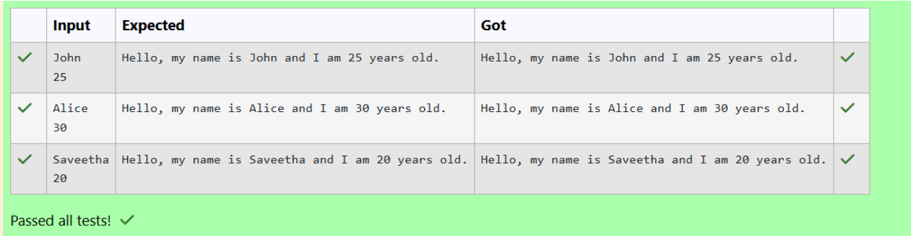

# Ex.No:2(A) CLASS AND OBJECT

## QUESTION:
Create a class Person with attributes name and age. Write a method greet() that prints: Hello, my name is <name> and I am <age> years old.

## AIM:
To write a Java program that demonstrates the concept of Class and Object using a Person class with attributes and a method.


## ALGORITHM :
1.	Start the program.
2.	Import the necessary package 'java.util'
3.	Create a class named Person with attributes name and age.
4. Define a method greet() that prints the message using the attributes.
5. In the main() method, create an object of the Person class.
6. Read the name and age values from the user.
7. Call the greet() method using the object.
8. End the program.	


## PROGRAM:
 ```
/*
Program to implement a Class and Objects using Java
Developed by: HARIHARAN J
RegisterNumber: 212223240047 
*/
```

## SOURCE CODE:
```
import java.util.Scanner;

class prog {
    String name;
    int age;

    prog(String name, int age) {
        this.name = name;
        this.age = age;
    }

    void greet() 
    {
        System.out.println("Hello, my name is " + name + " and I am " + age + " years old.");
    }

    public static void main(String[] args) {
        Scanner scanner = new Scanner(System.in);
       
        String name = scanner.nextLine(); 
        int age = scanner.nextInt();      

        prog person = new prog(name, age); 
        person.greet(); 

    }


}

```


## OUTPUT:



## RESULT:

Thus, the Java program to implement a Class and Object using a Person class was successfully executed and verified.
