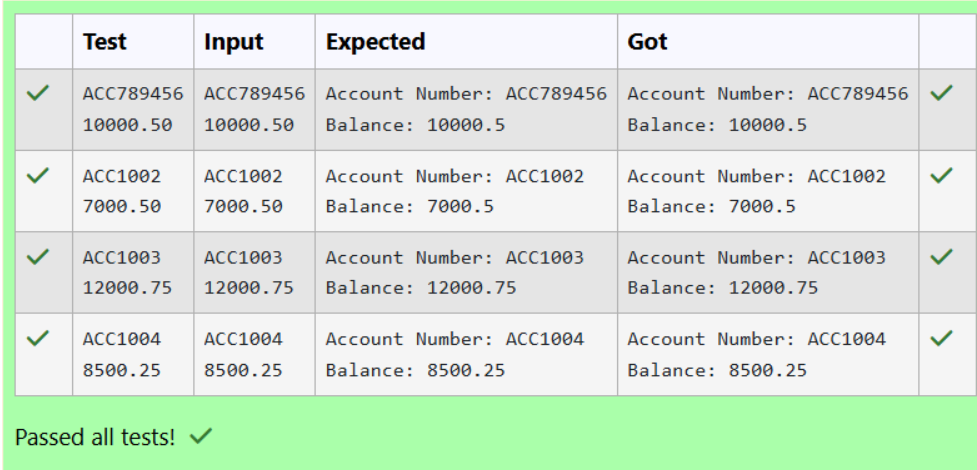

# Ex.No:2(C) ACCESS SPECIFIERS

## QUESTION:
Write a Java program to create a class called BankAccount with private instance variables accountNumber and balance. Provide public getter and setter methods to access and modify these variables.

## AIM:
To write a Java program that demonstrates the use of access specifiers, specifically using private for data hiding and public methods to access and modify values.

## ALGORITHM :
1.	Start the program.
2.	Import the necessary package 'java.util'
3.	Create a class BankAccount with private variables accountNumber and balance.
4. Provide public getter and setter methods for both variables.
5. Inside the main method, create an object of BankAccount.
6. Use setter methods to assign values to accountNumber and balance.
7. Display the values using getter methods.
8. Stop the program.


## PROGRAM:
 ```
/*
Program to implement a Access Specifiers using Java
Developed by: HARIHARAN J
RegisterNumber:212223240047
*/
```

## SOURCE CODE:
```
import java.util.Scanner;

public class Main 
{
    static class BankAccount 
    {
        private String accountNumber;
        private double balance;
        public String getAccountNumber()
        {
            return accountNumber;
        }
        public void setAccountNumber(String accountNumber) 
        {
            this.accountNumber = accountNumber;
        }
        public double getBalance() 
        {
            return balance;
        }
        public void setBalance(double balance)
        {
            this.balance = balance;
        }
    }

    public static void main(String[] args) 
    {
        Scanner sc = new Scanner(System.in);
        BankAccount account = new BankAccount();
        String accNo = sc.nextLine();
        double bal = sc.nextDouble();
        account.setAccountNumber(accNo);
        account.setBalance(bal);
        System.out.println("Account Number: "+account.getAccountNumber());
        System.out.println("Balance: "+account.getBalance());
    }
}
```


## OUTPUT:



## RESULT:
Thus, a Java program to implement Access Specifiers using private variables with public getter and setter methods was executed successfully.


