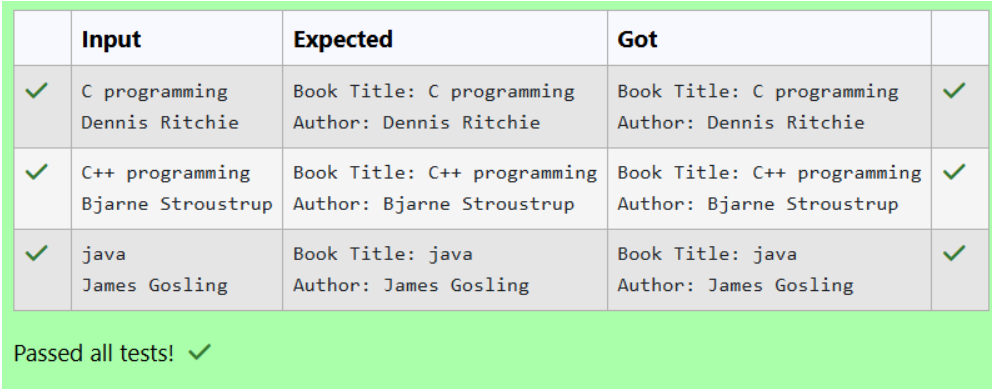

# Ex.No:2(D) VARIABLE SCOPE AND CONSTRUCTOR

## QUESTION:
Create a Java class Book with instance variables title and author.

## AIM:
To write a Java program to demonstrate variable scope and the use of a constructor to initialize instance variables.

## ALGORITHM :
1.	Start the program.
2.	Import the necessary package 'java.util'
3.	Create a class named Book with instance variables title and author.
4. Create a parameterized constructor to initialize these variables.
5. In the main() method, create an object of the Book class and pass values through the constructor.
6. Display the values.
7. End the program.


## PROGRAM:
 ```
/*
Program to implement a Variable scope and Constructor using Java
Developed by: HARIHARAN J
RegisterNumber:212223240047
*/
```

## SOURCE CODE:
```
import java.util.Scanner;

class Book 
{
    String title;
    String author;
    Book(String t, String a)
    {
        title = t;
        author = a;
    }

    void display() {
        System.out.println("Book Title: " + title);
        System.out.println("Author: " + author);
    }
}

class prog {
    public static void main(String[] args)
    {
        Scanner sc = new Scanner(System.in);
        
        String title = sc.nextLine();   
        String author = sc.nextLine(); 

        Book b = new Book(title, author);
        b.display();

        sc.close();
    }
}
```


## OUTPUT:



## RESULT:

Thus, the Java program to demonstrate variable scope and constructor was executed successfully.


